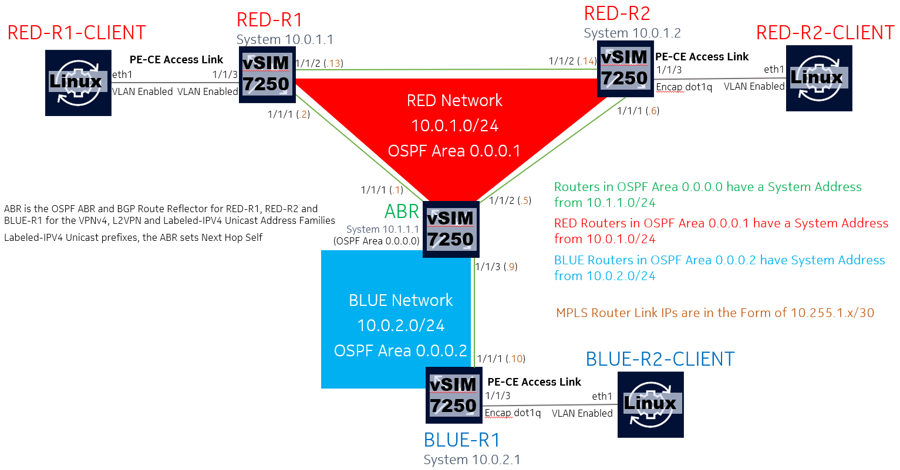

# Containerlab based Nokia Seamless-MPLS demo including pySROS and Event Handler System to simplify BGP-VPLS (RFC4761) configuration activities when using RSVP-TE signaled LSPs

## Base Infrastructure Build and Test Scenario 

This Scenario is the infrastructure build and test component of the [Seamless-MPLS Demo](README.md)

The following diagram highlights the infrastructure, IGP and BGP topology of the network:





When this network is instantiated, RED-R1 and RED-R2 (in OPSF area 0.0.0.1) will be able to communicate with each other and reach BLUE-R1 via the ABR.

Within each OSPF area, routers will be dynamically create RSVP-TE signaled LSPs to each other using lsp-templates
Each route will also have a manually created RSVP-TE signaled LSPs to reach the ABR.


This network is modeled using containerlab version 0.48.1

## Containerlab Node List

|Node Name|Kind|Model|Version|Role|
|:--------|:---|:----|:---|:---|
|ABR| vr-sros|7250 IXR-e | 23.10.R1|OSPF ABR + Inline BGP RR (IPv4, Labeled-IPv4 Unicast, L2VPN, VPNv4)|
|RED-R1| vr-sros| 7250 IXR-e | 23.10.R1| OSPF Area 0.0.0.1 PE Router - RRC of ABR |
|RED-R1-CLIENT| linux |Alpine Linux | Latest |Service Attached Client of RED-R1 |
|RED-R2| vr-sros| 7250 IXR-e | 23.10.R1|OSPF Area 0.0.0.1 PE Router - RRC of ABR |
|RED-R2-CLIENT| linux |Alpine Linux | Latest |Service Attached Client of RED-R2 |
|BLUE-R1| vr-sros| 7250 IXR-e | 23.10.R1|OSPF Area 0.0.0.2 PE Router - RRC of ABR |
|BLUE-R1-CLIENT| linux |Alpine Linux | Latest | Service Attached Client of BLUE-R1 |

## Default Credentials
SROS Router credentials = admin/admin

## Alpine Linux Container command example

RED-R1-CLIENT to ping its gateway RED-R1 (172.16.101.254) from its directly connected interface (172.16.101.1):
```
docker exec -it clab-RED-R1-HOST ping 172.16.101.254 -I 172.16.101.1 -c 3
```

While there wont be any CLIENT related activities in this scenario, it's kept for completeness 

## Step #0 - Obtain Containerlab (this lab was developed using containerlab version 0.42.0)
https://containerlab.dev/install/

## Step #1 - Ensure that you have a SROS docker image and valid license key

If necessary edit bgp-vpls.yml to align with your environment (this lab is using SROS version 23.10.R1, and the license file is specified to be found in  ~/23.x_SR_OS_VSR-SIM_License.txt)

For instructions on creating a docker image if you have a https://containerlab.dev/manual/vrnetlab/

For a valid license key, reach out to your appropriate Nokia contact.

## Step #2 - Start the Container Lab Instance

This is where the 4 routers and 3 linux containers and associated interconnections described in *bgp-vpls.yml* will be instantiated

```
sudo containerlab deploy --reconfigure --topo bgp-vpls.yml
```

The *reconfigure* flag will ignore any previous router configurations that may have been saved (this may or may not be desired - exclude this flag as required)

As we are using ["partial" configurations](base-configs/), as soon as containerlab returns to the console prompt, the environment will be ready to connect and perform actions.

## Step #3 - Check the LSP States

As we have a high level of confidence that this network should be running, we will jump directly to the LSPs and check what is configured and what is in service:


**LSPs on RED-R1:**

```
A:admin@RED-R1# show router mpls lsp

===============================================================================
MPLS LSPs (Originating)
===============================================================================
LSP Name                                            Tun     Fastfail  Adm  Opr
  To                                                Id      Config
-------------------------------------------------------------------------------
ABR                                                 1       Yes       Up   Up
  10.1.1.1
AUTOMESH-10.0.1.2-61441                             61441   Yes       Up   Up
  10.0.1.2
-------------------------------------------------------------------------------
LSPs : 3
===============================================================================
```

As RED-R2 (system address 10.0.1.2) is in the same OSPF area as RED-R1 (system address 10.0.1.1), an LSP-Template instantiated LSP (AUTOMESH-10.0.1.2) is created
The manual LSP to ABR is also established


**LSPs on RED-R2:**
```
A:admin@RED-R2# show router mpls lsp

===============================================================================
MPLS LSPs (Originating)
===============================================================================
LSP Name                                            Tun     Fastfail  Adm  Opr
  To                                                Id      Config
-------------------------------------------------------------------------------
ABR                                                 1       Yes       Up   Up
  10.1.1.1
AUTOMESH-10.0.1.1-61441                             61441   Yes       Up   Up
  10.0.1.1
-------------------------------------------------------------------------------
LSPs : 2
===============================================================================

```

Similar to the above, as RED-R1 (system address 10.0.1.1) is in the same OSPF area as RED-R2 (system address 10.0.1.2), an LSP-Template instantiated LSP (AUTOMESH-10.0.1.1) is created
The manual LSP to ABR is also established


**LSPs on BLUE-R1:**
```
A:admin@BLUE-R1# show router mpls lsp

===============================================================================
MPLS LSPs (Originating)
===============================================================================
LSP Name                                            Tun     Fastfail  Adm  Opr
  To                                                Id      Config
-------------------------------------------------------------------------------
ABR                                                 1       Yes       Up   Up
  10.1.1.1
-------------------------------------------------------------------------------
LSPs : 1
===============================================================================

```

BLUE-R1 is on its own in OSPF area 0.0.0.2, however it does have the LSP-Template AUTOMESH configuration in place, so if additional routers with a system address associated with OSPF area 0.0.0.2 (10.0.2.0/24) join the network later, AUTOMESH lsps will be built to them too.  Like the RED routers this also has a static LSP to the ABR.
  
**LSPs on ABR:**

```
A:admin@ABR# show router mpls lsp

===============================================================================
MPLS LSPs (Originating)
===============================================================================
LSP Name                                            Tun     Fastfail  Adm  Opr
  To                                                Id      Config
-------------------------------------------------------------------------------
BLUE-R1                                             1       Yes       Up   Up
  10.0.2.1
RED-R1                                              2       Yes       Up   Up
  10.0.1.1
RED-R2                                              3       Yes       Up   Up
  10.0.1.2
-------------------------------------------------------------------------------
LSPs : 3
===============================================================================
```

The ABR has static LSPs to each of the Non-ABR routers that it provides inter-as connectivity for.

## Step #4 - Check BGP Labeled Unicast Operation

**BGP on RED-R1:**

```
A:admin@RED-R1# show router bgp summary all

===============================================================================
BGP Summary
===============================================================================
Legend : D - Dynamic Neighbor
===============================================================================
Neighbor
Description
ServiceId          AS PktRcvd InQ  Up/Down   State|Rcv/Act/Sent (Addr Family)
                      PktSent OutQ
-------------------------------------------------------------------------------
10.1.1.1
ABR
Def. Inst       64512    4793    0 01d15h32m 0/0/0 (VpnIPv4)
                         4783    0           0/0/0 (L2VPN)
                                             6/2/1 (Lbl-IPv4)

-------------------------------------------------------------------------------

[/]
A:admin@RED-R1# show router bgp routes label-ipv4 | match '^u' post-lines 2
u*>i  10.0.2.1/32                                        100         None
      10.1.1.1                                           20          100
      No As-Path                                                     524281
u*>i  10.1.1.1/32                                        100         None
      10.1.1.1                                           5           100
      No As-Path                                                     524287
```
RED-R1 is sending a single labeled-unicast route (it's system address) to the ABR and is recieving multiple back but only two are active (For ABR and BLUE-R1)
As there are no services yet provisioned in the network, there are no routes associated with the VpnIPv4 or L2VPN address families


**BGP on RED-R2:**

```
A:admin@RED-R2# show router bgp summary all

===============================================================================
BGP Summary
===============================================================================
Legend : D - Dynamic Neighbor
===============================================================================
Neighbor
Description
ServiceId          AS PktRcvd InQ  Up/Down   State|Rcv/Act/Sent (Addr Family)
                      PktSent OutQ
-------------------------------------------------------------------------------
10.1.1.1
ABR
Def. Inst       64512    4814    0 01d15h38m 0/0/0 (VpnIPv4)
                         4788    0           0/0/0 (L2VPN)
                                             6/2/1 (Lbl-IPv4)

-------------------------------------------------------------------------------

[/]
A:admin@RED-R2# show router bgp routes label-ipv4 | match '^u' post-lines 2
u*>i  10.0.2.1/32                                        100         None
      10.1.1.1                                           19          100
      No As-Path                                                     524281
u*>i  10.1.1.1/32                                        100         None
      10.1.1.1                                           1           100
      No As-Path                                                     524287
```
RED-R2 is sending a single labeled-unicast route (it's system address) to the ABR and is recieving multiple back but only two are active (For ABR and BLUE-R1)
As there are no services yet provisioned in the network, there are no routes associated with the VpnIPv4 or L2VPN address families


**BGP on BLUE-R1:**

```
A:admin@BLUE-R1# show router bgp summary all

===============================================================================
BGP Summary
===============================================================================
Legend : D - Dynamic Neighbor
===============================================================================
Neighbor
Description
ServiceId          AS PktRcvd InQ  Up/Down   State|Rcv/Act/Sent (Addr Family)
                      PktSent OutQ
-------------------------------------------------------------------------------
10.1.1.1
ABR
Def. Inst       64512    4831    0 01d15h41m 0/0/0 (VpnIPv4)
                         4794    0           0/0/0 (L2VPN)
                                             6/3/1 (Lbl-IPv4)

-------------------------------------------------------------------------------

[/]
A:admin@BLUE-R1# show router bgp routes label-ipv4 | match '^u' post-lines 2
u*>i  10.0.1.1/32                                        100         None
      10.1.1.1                                           18          10
      No As-Path                                                     524282
u*>i  10.0.1.2/32                                        100         None
      10.1.1.1                                           17          10
      No As-Path                                                     524283
u*>i  10.1.1.1/32                                        100         None
      10.1.1.1                                           9           10
      No As-Path                                                     524287

```
BLUE-R1 is sending a single labeled-unicast route (it's system address) to the ABR and is recieving multiple back but only thre are active (For ABR, RED-R1 and RED-R2)
As there are no services yet provisioned in the network, there are no routes associated with the VpnIPv4 or L2VPN address families


**BGP on ABR:**

```
A:admin@ABR# show router bgp summary all

===============================================================================
BGP Summary
===============================================================================
Legend : D - Dynamic Neighbor
===============================================================================
Neighbor
Description
ServiceId          AS PktRcvd InQ  Up/Down   State|Rcv/Act/Sent (Addr Family)
                      PktSent OutQ
-------------------------------------------------------------------------------
10.0.1.1
RED-R1
Def. Inst       64512    4803    0 01d15h42m 0/0/0 (VpnIPv4)
                         4820    0           0/0/0 (L2VPN)
                                             1/0/6 (Lbl-IPv4)
10.0.1.2
RED-R2
Def. Inst       64512    4797    0 01d15h42m 0/0/0 (VpnIPv4)
                         4826    0           0/0/0 (L2VPN)
                                             1/0/6 (Lbl-IPv4)
10.0.2.1
BLUE-R1
Def. Inst       64512    4797    0 01d15h42m 0/0/0 (VpnIPv4)
                         4834    0           0/0/0 (L2VPN)
                                             1/0/6 (Lbl-IPv4)

-------------------------------------------------------------------------------

[/]
A:admin@ABR# show router bgp routes label-ipv4 | match '^u' post-lines 2

```
ABR is sending multiple labeled-unicast routes (it's system address, and those of the other routers) and is recieving one back but none are active as OSPF has a better routing preference than iBGP.
As there are no services yet provisioned in the network, there are no routes associated with the VpnIPv4 or L2VPN address families

## Step #5 - Check the Routing Table

As a final check, we will review the routing tables of each route:

**RED-R1 Routing Table:**

```
A:admin@RED-R1# show router route-table

===============================================================================
Route Table (Router: Base)
===============================================================================
Dest Prefix[Flags]                            Type    Proto     Age        Pref
      Next Hop[Interface Name]                                    Metric
-------------------------------------------------------------------------------
0.0.0.0/0                                     Remote  OSPF      14h50m31s  10
       10.255.1.1                                                   101
10.0.1.1/32                                   Local   Local     01d15h46m  0
       system                                                       0
10.0.1.2/32                                   Remote  OSPF      14h52m06s  10
       10.255.1.14                                                  100
10.0.2.1/32                                   Remote  BGP_LABEL 14h49m07s  170
       10.1.1.1 (tunneled:RSVP:1)                                   100
10.1.1.1/32                                   Remote  BGP_LABEL 14h49m07s  170
       10.1.1.1 (tunneled:RSVP:1)                                   100
10.255.1.0/30                                 Local   Local     01d15h46m  0
       ABR                                                          0
10.255.1.8/30                                 Remote  OSPF      14h50m07s  10
       10.255.1.14                                                  200
10.255.1.12/30                                Local   Local     01d15h46m  0
       RED-R2                                                       0
-------------------------------------------------------------------------------
No. of Routes: 8
Flags: n = Number of times nexthop is repeated
       B = BGP backup route available
       L = LFA nexthop available
       S = Sticky ECMP requested
===============================================================================

```

**RED-R2 Routing Table:**
```
A:admin@RED-R2# show router route-table

===============================================================================
Route Table (Router: Base)
===============================================================================
Dest Prefix[Flags]                            Type    Proto     Age        Pref
      Next Hop[Interface Name]                                    Metric
-------------------------------------------------------------------------------
0.0.0.0/0                                     Remote  OSPF      01d00h36m  10
       10.255.1.9                                                   11
10.0.1.1/32                                   Remote  OSPF      01d00h36m  10
       10.255.1.9                                                   20
10.0.1.2/32                                   Local   Local     01d00h36m  0
       system                                                       0
10.0.2.1/32                                   Remote  BGP_LABEL 21h15m16s  170
       10.1.1.1 (tunneled:RSVP:1)                                   10
10.1.1.1/32                                   Remote  BGP_LABEL 21h15m16s  170
       10.1.1.1 (tunneled:RSVP:1)                                   10
10.255.1.0/30                                 Remote  OSPF      01d00h36m  10
       10.255.1.9                                                   20
10.255.1.8/30                                 Local   Local     01d00h36m  0
       ABR                                                          0
10.255.1.12/30                                Local   Local     01d00h36m  0
       RED-R1                                                       0
-------------------------------------------------------------------------------
No. of Routes: 8
Flags: n = Number of times nexthop is repeated
       B = BGP backup route available
       L = LFA nexthop available
       S = Sticky ECMP requested
===============================================================================
```

RED-R1 and RED-R2 as they are in totally stubby OSPF Areas, do not see specific routes outside of their area (0.0.0.1) but do have a default-route via the ABR (10.1.1.1)

As the ABR system address is in OSPF area 0.0.0.0 and BLUE-R1 is in OSPF area 0.0.0.2, RED-R1 and RED-R2 learn of this via BGP and label-ipv4 address family - these appear in the routing table as protocol **BGP_LABEL** and the transport is over a RSVP-TE signaled LSP (to the ABR)

**BLUE-R1 Routing Table:**
```
A:admin@RED-R2# show router route-table

===============================================================================
Route Table (Router: Base)
===============================================================================
Dest Prefix[Flags]                            Type    Proto     Age        Pref
      Next Hop[Interface Name]                                    Metric
-------------------------------------------------------------------------------
0.0.0.0/0                                     Remote  OSPF      14h50m29s  10
       10.255.1.9                                                   101
10.0.1.1/32                                   Remote  OSPF      14h52m34s  10
       10.255.1.13                                                  100
10.0.1.2/32                                   Local   Local     01d15h46m  0
       system                                                       0
10.0.2.1/32                                   Remote  BGP_LABEL 14h48m53s  170
       10.1.1.1 (tunneled:RSVP:1)                                   100
10.1.1.1/32                                   Remote  BGP_LABEL 14h48m53s  170
       10.1.1.1 (tunneled:RSVP:1)                                   100
10.255.1.0/30                                 Remote  OSPF      14h50m29s  10
       10.255.1.13                                                  200
10.255.1.8/30                                 Local   Local     01d15h46m  0
       ABR                                                          0
10.255.1.12/30                                Local   Local     01d15h46m  0
       RED-R1                                                       0
-------------------------------------------------------------------------------
No. of Routes: 8
Flags: n = Number of times nexthop is repeated
       B = BGP backup route available
       L = LFA nexthop available
       S = Sticky ECMP requested
===============================================================================
```


OSPF area 0.0.0.2 is also a totally stubby area, so BLUE-R1 only knows the specific routes to RED-R1, RED-R2 and ABR via BGP Labeled Unicast - these appear in the routing table as protocol **BGP_LABEL** and the transport is over a RSVP-TE signaled LSP (the LSP to the ABR)


**ABR Routing Table:**

```
A:admin@ABR# show router route-table

===============================================================================
Route Table (Router: Base)
===============================================================================
Dest Prefix[Flags]                            Type    Proto     Age        Pref
      Next Hop[Interface Name]                                    Metric
-------------------------------------------------------------------------------
10.0.1.1/32                                   Remote  OSPF      14h53m58s  10
       10.255.1.2                                                   100
10.0.1.2/32                                   Remote  OSPF      14h54m57s  10
       10.255.1.10                                                  100
10.0.2.1/32                                   Remote  OSPF      14h55m03s  10
       10.255.1.6                                                   100
10.1.1.1/32                                   Local   Local     01d15h49m  0
       system                                                       0
10.255.1.0/30                                 Local   Local     01d15h49m  0
       RED-R1                                                       0
10.255.1.4/30                                 Local   Local     01d15h49m  0
       BLUE-R1                                                      0
10.255.1.8/30                                 Local   Local     01d15h49m  0
       RED-R2                                                       0
10.255.1.12/30                                Remote  OSPF      14h53m58s  10
       10.255.1.2                                                   200
-------------------------------------------------------------------------------
No. of Routes: 8
Flags: n = Number of times nexthop is repeated
       B = BGP backup route available
       L = LFA nexthop available
       S = Sticky ECMP requested
===============================================================================

```

ABR having it's system address in the backbone OSPF area and having connectivity to RED-R1, RED-R2 and BLUE-R1 has visibility within each OSPF area, meaning that the BGP labeled unicast routes are not active in the routing table.

## Step #6 - LSP Path Tracing
Verify the Dataplane reachability between NEs:


**RED-R1 RSVP-TE and BGP-LABEL Tracing:**

```
A:admin@RED-R1# oam lsp-trace rsvp-te lsp-name "ABR"
lsp-trace to ABR: 1 hops min, 30 hops max, 116 byte packets
1  10.1.1.1  rtt=10.4ms rc=3(EgressRtr) rsc=1

[/]
A:admin@RED-R1# oam lsp-trace rsvp-te lsp-name "AUTOMESH-10.0.1.2-61441"
lsp-trace to AUTOMESH-10.0.1.2-61441: 1 hops min, 30 hops max, 116 byte packets
1  10.0.1.2  rtt=10.0ms rc=3(EgressRtr) rsc=1

[/]
A:admin@RED-R1# oam lsp-trace bgp-label prefix 10.1.1.1/32
lsp-trace to 10.1.1.1/32: 1 hops min, 30 hops max, 104 byte packets
1  10.1.1.1  rtt=9.58ms rc=3(EgressRtr) rsc=1

[/]
A:admin@RED-R1# oam lsp-trace bgp-label prefix 10.0.2.1/32
lsp-trace to 10.0.2.1/32: 1 hops min, 30 hops max, 104 byte packets
1  10.1.1.1  rtt=11.4ms rc=8(DSRtrMatchLabel) rsc=1
2  10.0.2.1  rtt=15.8ms rc=3(EgressRtr) rsc=1
```

**RED-R2 RSVP-TE and BGP-LABEL Tracing:**

```
A:admin@RED-R2# oam lsp-trace rsvp-te lsp-name "ABR"
lsp-trace to ABR: 1 hops min, 30 hops max, 116 byte packets
1  10.1.1.1  rtt=9.35ms rc=3(EgressRtr) rsc=1

[/]
A:admin@RED-R2# oam lsp-trace rsvp-te lsp-name "AUTOMESH-10.0.1.1-61441"
lsp-trace to AUTOMESH-10.0.1.1-61441: 1 hops min, 30 hops max, 116 byte packets
1  10.0.1.1  rtt=9.59ms rc=3(EgressRtr) rsc=1

[/]
A:admin@RED-R2# oam lsp-trace bgp-label prefix 10.0.2.1/32
lsp-trace to 10.0.2.1/32: 1 hops min, 30 hops max, 104 byte packets
1  10.1.1.1  rtt=10.2ms rc=8(DSRtrMatchLabel) rsc=1
2  10.0.2.1  rtt=15.5ms rc=3(EgressRtr) rsc=1

```

**BLUE-R1 RSVP-TE and BGP-LABEL Tracing:**
```
A:admin@BLUE-R1# oam lsp-trace rsvp-te lsp-name "ABR"
lsp-trace to ABR: 1 hops min, 30 hops max, 116 byte packets
1  10.1.1.1  rtt=9.99ms rc=3(EgressRtr) rsc=1

[/]
A:admin@BLUE-R1# oam lsp-trace bgp-label prefix 10.1.1.1/32
lsp-trace to 10.1.1.1/32: 1 hops min, 30 hops max, 104 byte packets
1  10.1.1.1  rtt=9.94ms rc=3(EgressRtr) rsc=1

[/]
A:admin@BLUE-R1# oam lsp-trace bgp-label prefix 10.0.1.1/32
lsp-trace to 10.0.1.1/32: 1 hops min, 30 hops max, 104 byte packets
1  10.1.1.1  rtt=6.15ms rc=8(DSRtrMatchLabel) rsc=1
2  10.0.1.1  rtt=10.4ms rc=3(EgressRtr) rsc=1

[/]
A:admin@BLUE-R1# oam lsp-trace bgp-label prefix 10.0.1.2/32
lsp-trace to 10.0.1.2/32: 1 hops min, 30 hops max, 104 byte packets
1  10.1.1.1  rtt=9.67ms rc=8(DSRtrMatchLabel) rsc=1
2  10.0.1.2  rtt=13.9ms rc=3(EgressRtr) rsc=1

```

This infrastructure appears to be in a good position to proceed to [The L3VPN (RFC4364 - MPLS/BGP IP-VPN) Build and Test Sequence](02_L3ServiceBuildandTest.md)