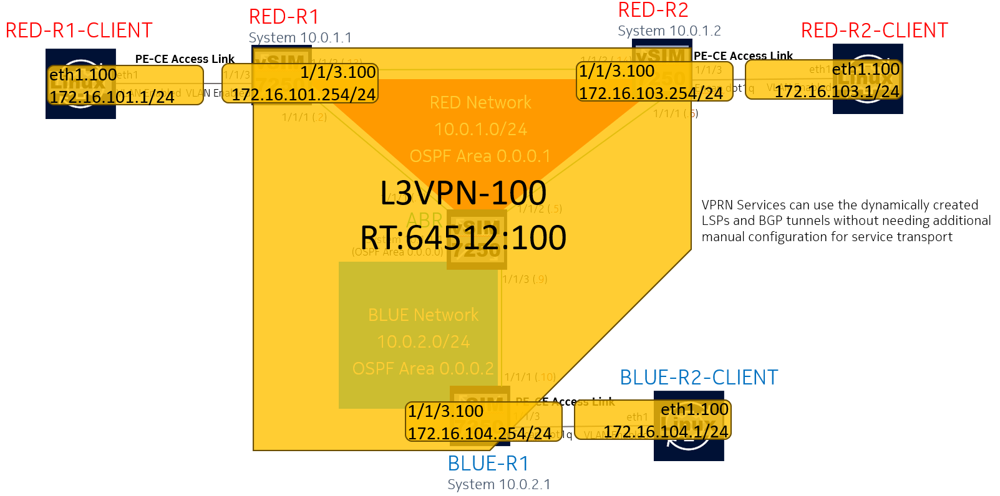

# Containerlab based Nokia Seamless-MPLS demo including pySROS and Event Handler System to simplify BGP-VPLS (RFC4761) configuration activities when using RSVP-TE signaled LSPs

## RFC4364 BGP/MPLS IP-VPN (VPRN) using RSVP-TE signaled LSPs Build and Test Scenario 

This Scenario is the infrastructure build and test component of the [Seamless-MPLS Demo](README.md)

The previous scenario was[The Base Infrastructure Build and Test Sequence](01_BaseInfrastructureBuildandTest.md)

The following diagram highlights the Simple Full-Mesh L3VPN (VPRN) service to be provisioned on the network (assuming that the infrastructure is already in place):



## L3VPN-100 PE and CE Details:

|Node Name|RD|RT|PE-CE Role|PE-CE Interface|PE-CE IP Address|
|-|---|---|---|---|---|
|RED-R1| 64512:100 | 64512:100 | PE|RED-R1-CLIENT-VL100 (1/1/3.100)  |172.16.101.254/24 |
|RED-R1-CLIENT| N/A |N/A | CE | eth1.100 | 172.16.101.1/24 |
|RED-R2| 64512:100 | 64512:100 | PE|RED-R2-CLIENT-VL100 (1/1/3.100)  |172.16.102.254/24 |
|RED-R2-CLIENT| N/A |N/A | CE | eth1.100 | 172.16.102.1/24 |
|BLUE-R1| 64512:100 | 64512:100 | PE|BLUE-R1-CLIENT-VL100 (1/1/3.100)  |172.16.103.254/24 |
|BLUE-R1-CLIENT| N/A |N/A | CE | eth1.100 | 172.16.103.1/24 |

## Service Configurations:

The L3VPN Configurations for each of the routers are in the directory [service-configs/L3VPN-RFC4364](service-configs/L3VPN-RFC4364)

ssh into each of the PE routers and apply the configurations.

For example with RED-R1:

```
adam@m4600-cl:~/bgp-vpls-pysros-ehs$ ssh admin@clab-vpls-red-r1

admin@clab-vpls-red-r1's password:

 SR OS Software
 Copyright (c) Nokia 2023.  All Rights Reserved.

 Trademarks

 Nokia and the Nokia logo are registered trademarks of Nokia. All other
 trademarks are the property of their respective owners.

 IMPORTANT: READ CAREFULLY

 The SR OS Software (the "Software") is proprietary to Nokia and is subject
 to and governed by the terms and conditions of the End User License
 Agreement accompanying the product, made available at the time of your order,
 or posted on the Nokia website (collectively, the "EULA").  As set forth
 more fully in the EULA, use of the Software is strictly limited to your
 internal use.  Downloading, installing, or using the Software constitutes
 acceptance of the EULA and you are binding yourself and the business entity
 that you represent to the EULA.  If you do not agree to all of the terms of
 the EULA, then Nokia is unwilling to license the Software to you and (a) you
 may not download, install or use the Software, and (b) you may return the
 Software as more fully set forth in the EULA.

 This product contains cryptographic features and is subject to United States
 and local country laws governing import, export, transfer and use. Delivery
 of Nokia cryptographic products does not imply third-party authority to
 import, export, distribute or use encryption.

 If you require further assistance please contact us by sending an email
 to support@nokia.com.


[/]
A:admin@RED-R1# configure private
INFO: CLI #2070: Entering private configuration mode
INFO: CLI #2061: Uncommitted changes are discarded on configuration mode exit

[pr:/configure]
A:admin@RED-R1#     /configure service vprn "L3VPN-100" admin-state enable

[pr:/configure]
A:admin@RED-R1#     /configure service vprn "L3VPN-100" service-id 100

[pr:/configure]
A:admin@RED-R1#     /configure service vprn "L3VPN-100" customer "1"

[pr:/configure]
A:admin@RED-R1#     /configure service vprn "L3VPN-100" bgp-ipvpn mpls admin-state enable

[pr:/configure]
A:admin@RED-R1#     /configure service vprn "L3VPN-100" bgp-ipvpn mpls route-distinguisher "64512:100"

[pr:/configure]
A:admin@RED-R1#     /configure service vprn "L3VPN-100" bgp-ipvpn mpls vrf-target community "target:64512:100"

[pr:/configure]
A:admin@RED-R1#     /configure service vprn "L3VPN-100" bgp-ipvpn mpls auto-bind-tunnel resolution any

[pr:/configure]
A:admin@RED-R1#     /configure service vprn "L3VPN-100" interface "RED-R1-CLIENT-VL100" ipv4 primary address 172.16.101.254

[pr:/configure]
A:admin@RED-R1#     /configure service vprn "L3VPN-100" interface "RED-R1-CLIENT-VL100" ipv4 primary prefix-length 24

[pr:/configure]
A:admin@RED-R1#     /configure service vprn "L3VPN-100" interface "RED-R1-CLIENT-VL100" sap 1/1/3:100 admin-state enable

[pr:/configure]
A:admin@RED-R1# commit

[pr:/configure]
A:admin@RED-R1# exit all
INFO: CLI #2074: Exiting private configuration mode

```

Apply the configuration to RED-R2 and BLUE-R1 as well (ensuring to enter configuration private and then using commit to apply the changes, and finally using exit all to leave configuration mode)

As part of the containerlab [bgp-vpls.yml](bgp-vpls.yml) configuration, the **RED-R1-CLIENT**, **RED-R2-CLIENT** and **BLUE-R1-CLIENT** have already had their relevant IP interfaces and static routes applied

## Service Validation

Make sure each PE router is able to ping their own attached host and check the routing table for each VPRN

### RED-R1 can ping RED-R1-CLIENT in router-instance L3VPN-100

```
A:admin@RED-R1# ping 172.16.101.1 router-instance "L3VPN-100" count 3
PING 172.16.101.1 56 data bytes
64 bytes from 172.16.101.1: icmp_seq=1 ttl=64 time=3.05ms.
64 bytes from 172.16.101.1: icmp_seq=2 ttl=64 time=2.78ms.
64 bytes from 172.16.101.1: icmp_seq=3 ttl=64 time=3.11ms.
```

### RED-R1 can see the routes towards RED-R1-CLIENT, RED-R2-CLIENT and BLUE-R1-CLIENT in router-instance L3VPN-100

```
A:admin@RED-R1# show router 100 route-table

===============================================================================
Route Table (Service: 100)
===============================================================================
Dest Prefix[Flags]                            Type    Proto     Age        Pref
      Next Hop[Interface Name]                                    Metric
-------------------------------------------------------------------------------
172.16.101.0/24                               Local   Local     00h05m56s  0
       RED-R1-CLIENT-VL100                                          0
172.16.102.0/24                               Remote  BGP VPN   00h03m18s  170
       10.0.1.2 (tunneled:RSVP:61441)                               100
172.16.103.0/24                               Remote  BGP VPN   00h01m19s  170
       10.0.2.1 (tunneled:BGP)                                      1000
-------------------------------------------------------------------------------
No. of Routes: 3
Flags: n = Number of times nexthop is repeated
       B = BGP backup route available
       L = LFA nexthop available
       S = Sticky ECMP requested
===============================================================================
```

### RED-R1 is using the AUTOMESH RSVP-TE Tunnel to RED-R2 (Tunnel 61441) and the BGP Tunnel to BLUE-R1

```
A:admin@RED-R1# show router mpls lsp

===============================================================================
MPLS LSPs (Originating)
===============================================================================
LSP Name                                            Tun     Fastfail  Adm  Opr
  To                                                Id      Config
-------------------------------------------------------------------------------
ABR                                                 1       Yes       Up   Up
  10.1.1.1
AUTOMESH-10.0.1.2-61441                             61441   Yes       Up   Up
  10.0.1.2
-------------------------------------------------------------------------------
LSPs : 2
===============================================================================

[/]
A:admin@RED-R1# show router tunnel-table

===============================================================================
IPv4 Tunnel Table (Router: Base)
===============================================================================
Destination           Owner     Encap TunnelId  Pref   Nexthop        Metric
   Color
-------------------------------------------------------------------------------
10.0.1.2/32 [B]       rsvp      MPLS  61441     7      10.255.1.14    100
10.0.2.1/32           bgp       MPLS  262147    12     10.1.1.1       1000
10.1.1.1/32 [B]       rsvp      MPLS  1         7      10.255.1.1     100
10.1.1.1/32           bgp       MPLS  262148    12     10.1.1.1       1000
-------------------------------------------------------------------------------
Flags: B = BGP or MPLS backup hop available
       L = Loop-Free Alternate (LFA) hop available
       E = Inactive best-external BGP route
       k = RIB-API or Forwarding Policy backup hop
===============================================================================

```

### RED-R2 can ping RED-R2-CLIENT in router-instance L3VPN-100
```
A:admin@RED-R2# ping 172.16.102.1 router-instance "L3VPN-100" count 3
PING 172.16.102.1 56 data bytes
64 bytes from 172.16.102.1: icmp_seq=1 ttl=64 time=3.47ms.
64 bytes from 172.16.102.1: icmp_seq=2 ttl=64 time=3.64ms.
64 bytes from 172.16.102.1: icmp_seq=3 ttl=64 time=3.72ms.

---- 172.16.102.1 PING Statistics ----
3 packets transmitted, 3 packets received, 0.00% packet loss
round-trip min = 3.47ms, avg = 3.61ms, max = 3.72ms, stddev = 0.106ms
```

### RED-R2 can see the routes towards RED-R1-CLIENT, RED-R2-CLIENT and BLUE-R1-CLIENT in router-instance L3VPN-100
```
A:admin@RED-R2# show router 100 route-table

===============================================================================
Route Table (Service: 100)
===============================================================================
Dest Prefix[Flags]                            Type    Proto     Age        Pref
      Next Hop[Interface Name]                                    Metric
-------------------------------------------------------------------------------
172.16.101.0/24                               Remote  BGP VPN   00h07m13s  170
       10.0.1.1 (tunneled:RSVP:61441)                               100
172.16.102.0/24                               Local   Local     00h04m35s  0
       RED-R2-CLIENT-VL100                                          0
172.16.103.0/24                               Remote  BGP VPN   00h02m36s  170
       10.0.2.1 (tunneled:BGP)                                      1000
-------------------------------------------------------------------------------
No. of Routes: 3
Flags: n = Number of times nexthop is repeated
       B = BGP backup route available
       L = LFA nexthop available
       S = Sticky ECMP requested
===============================================================================
```

### RED-R2 is using the AUTOMESH RSVP-TE Tunnel to RED-R1 (Tunnel 61441) and the BGP Tunnel to BLUE-R1
```
A:admin@RED-R2# show router mpls lsp

===============================================================================
MPLS LSPs (Originating)
===============================================================================
LSP Name                                            Tun     Fastfail  Adm  Opr
  To                                                Id      Config
-------------------------------------------------------------------------------
ABR                                                 1       Yes       Up   Up
  10.1.1.1
AUTOMESH-10.0.1.1-61441                             61441   Yes       Up   Up
  10.0.1.1
-------------------------------------------------------------------------------
LSPs : 2
===============================================================================

[/]
A:admin@RED-R2# show router tunnel-table

===============================================================================
IPv4 Tunnel Table (Router: Base)
===============================================================================
Destination           Owner     Encap TunnelId  Pref   Nexthop        Metric
   Color
-------------------------------------------------------------------------------
10.0.1.1/32 [B]       rsvp      MPLS  61441     7      10.255.1.13    100
10.0.2.1/32           bgp       MPLS  262147    12     10.1.1.1       1000
10.1.1.1/32 [B]       rsvp      MPLS  1         7      10.255.1.9     100
10.1.1.1/32           bgp       MPLS  262148    12     10.1.1.1       1000
-------------------------------------------------------------------------------
Flags: B = BGP or MPLS backup hop available
       L = Loop-Free Alternate (LFA) hop available
       E = Inactive best-external BGP route
       k = RIB-API or Forwarding Policy backup hop
===============================================================================
```

### BLUE-R1 can ping BLUE-R1-CLIENT in router-instance L3VPN-100
```
A:admin@BLUE-R1# ping 172.16.103.1 router-instance "L3VPN-100" count 3
PING 172.16.103.1 56 data bytes
64 bytes from 172.16.103.1: icmp_seq=1 ttl=64 time=3.14ms.
64 bytes from 172.16.103.1: icmp_seq=2 ttl=64 time=3.19ms.
64 bytes from 172.16.103.1: icmp_seq=3 ttl=64 time=2.69ms.

---- 172.16.103.1 PING Statistics ----
3 packets transmitted, 3 packets received, 0.00% packet loss
round-trip min = 2.69ms, avg = 3.01ms, max = 3.19ms, stddev = 0.227ms
```

### BLUE-R1 can see the routes towards RED-R1-CLIENT, RED-R2-CLIENT and BLUE-R1-CLIENT in router-instance L3VPN-100
```
A:admin@BLUE-R1# show router 100 route-table

===============================================================================
Route Table (Service: 100)
===============================================================================
Dest Prefix[Flags]                            Type    Proto     Age        Pref
      Next Hop[Interface Name]                                    Metric
-------------------------------------------------------------------------------
172.16.101.0/24                               Remote  BGP VPN   00h07m45s  170
       10.0.1.1 (tunneled:BGP)                                      1000
172.16.102.0/24                               Remote  BGP VPN   00h05m07s  170
       10.0.1.2 (tunneled:BGP)                                      1000
172.16.103.0/24                               Local   Local     00h03m08s  0
       BLUE-R1-CLIENT-VL100                                         0
-------------------------------------------------------------------------------
No. of Routes: 3
Flags: n = Number of times nexthop is repeated
       B = BGP backup route available
       L = LFA nexthop available
       S = Sticky ECMP requested
===============================================================================
```

### BLUE-R1 is using BGP Tunnels to RED-R1 and RED-R2

```
A:admin@BLUE-R1# show router mpls lsp

===============================================================================
MPLS LSPs (Originating)
===============================================================================
LSP Name                                            Tun     Fastfail  Adm  Opr
  To                                                Id      Config
-------------------------------------------------------------------------------
ABR                                                 1       Yes       Up   Up
  10.1.1.1
-------------------------------------------------------------------------------
LSPs : 1
===============================================================================

[/]
A:admin@BLUE-R1# show router tunnel-table

===============================================================================
IPv4 Tunnel Table (Router: Base)
===============================================================================
Destination           Owner     Encap TunnelId  Pref   Nexthop        Metric
   Color
-------------------------------------------------------------------------------
10.0.1.1/32           bgp       MPLS  262149    12     10.1.1.1       1000
10.0.1.2/32           bgp       MPLS  262148    12     10.1.1.1       1000
10.1.1.1/32           rsvp      MPLS  1         7      10.255.1.5     10
10.1.1.1/32           bgp       MPLS  262150    12     10.1.1.1       1000
-------------------------------------------------------------------------------
Flags: B = BGP or MPLS backup hop available
       L = Loop-Free Alternate (LFA) hop available
       E = Inactive best-external BGP route
       k = RIB-API or Forwarding Policy backup hop
===============================================================================

```

### RED-R1-CLIENT to RED-R2-CLIENT reachability check
```
$ docker exec -it clab-vpls-RED-R1-CLIENT ping 172.16.102.1 -I 172.16.101.1 -c 3
PING 172.16.102.1 (172.16.102.1) from 172.16.101.1: 56 data bytes
64 bytes from 172.16.102.1: seq=0 ttl=62 time=2.414 ms
64 bytes from 172.16.102.1: seq=1 ttl=62 time=11.319 ms
64 bytes from 172.16.102.1: seq=2 ttl=62 time=10.355 ms

--- 172.16.102.1 ping statistics ---
3 packets transmitted, 3 packets received, 0% packet loss
round-trip min/avg/max = 2.414/8.029/11.319 ms
```
### RED-R1-CLIENT to BLUE-R1-CLIENT reachability check
```
$ docker exec -it clab-vpls-RED-R1-CLIENT ping 172.16.103.1 -I 172.16.101.1 -c 3
PING 172.16.103.1 (172.16.103.1) from 172.16.101.1: 56 data bytes
64 bytes from 172.16.103.1: seq=0 ttl=61 time=3.663 ms
64 bytes from 172.16.103.1: seq=1 ttl=61 time=15.536 ms
64 bytes from 172.16.103.1: seq=2 ttl=61 time=15.191 ms

--- 172.16.103.1 ping statistics ---
3 packets transmitted, 3 packets received, 0% packet loss
round-trip min/avg/max = 3.663/11.463/15.536 ms
```
### RED-R2-CLIENT to BLUE-R1-CLIENT reachability check
```
$ docker exec -it clab-vpls-RED-R2-CLIENT ping 172.16.103.1 -I 172.16.102.1 -c 3
PING 172.16.103.1 (172.16.103.1) from 172.16.102.1: 56 data bytes
64 bytes from 172.16.103.1: seq=0 ttl=61 time=2.756 ms
64 bytes from 172.16.103.1: seq=1 ttl=61 time=13.121 ms
64 bytes from 172.16.103.1: seq=2 ttl=61 time=14.442 ms

--- 172.16.103.1 ping statistics ---
3 packets transmitted, 3 packets received, 0% packet loss
round-trip min/avg/max = 2.756/10.106/14.442 ms

```

This L3VPN is operational, now proceed to [The L2VPN (RFC4761 - VPLS with BGP Auto discovery and Signalling) Build and Test Sequence](03_L2ServiceBuildandTest.md)