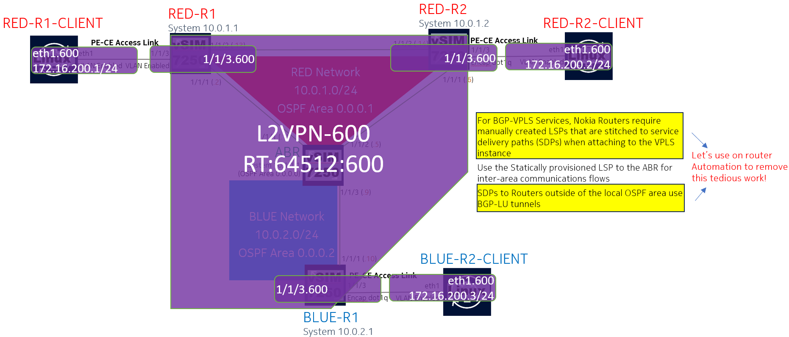

# Containerlab based Nokia Seamless-MPLS demo including pySROS and Event Handler System to simplify BGP-VPLS (RFC4761) configuration activities when using RSVP-TE signaled LSPs

## RFC4761 VPLS Using BGP for Auto-Discovery and Signaling using RSVP-TE signaled LSPs Build and Test Scenario 

This Scenario is the infrastructure build and test component of the [Seamless-MPLS Demo](README.md)

The scenario used to build the infrastructure is [The Base Infrastructure Build and Test Sequence](01_BaseInfrastructureBuildandTest.md)

The previous scenario was[The L3VPN (RFC4364 - MPLS/BGP IP-VPN) Build and Test Sequence](02_L3ServiceBuildandTest.md)

The following diagram highlights the Simple Full-Mesh L2VPN (BGP-VPLS) service to be provisioned on the network (assuming that the infrastructure is already in place):



## L2VPN-600 PE and CE Details:

|Node Name|RD|RT|PE-CE Role|PE-CE Interface|PE-CE IP Address|
|-|---|---|---|---|---|
|RED-R1| 64512:600 | 64512:600 | PE|1/1/3.600  |N/A |
|RED-R1-CLIENT| N/A |N/A | CE | eth1.600 | 172.16.200.1/24 |
|RED-R2| 64512:600 | 64512:600 | PE|1/1/3.600  |N/A |
|RED-R2-CLIENT| N/A |N/A | CE | eth1.600 | 172.16.200.2/24 |
|BLUE-R1| 64512:600 | 64512:600 | PE|1/1/3.600  |N/A |
|BLUE-R1-CLIENT| N/A |N/A | CE | eth1.600 | 172.16.200.3/24 |

**Note:** Compared to the L3VPN Service, there will be additional tasks necessary (SDPs between participating PE routers in the VPLS) to support full-operation.

For Nokia platforms when using RSVP-TE as the underlying transport it is necessary to utilise manually created SDPs that are bound to the RSVP-TE signaled LSPs.  While this activity is a bit of a burden, to make things more difficult the AUTOMESH LSPs that were created via LSP Templates and were helpful for the VPRN service instance cannot be bound to an SDP meaning that in the same IGP area, it will be necessary to build manual RSVP-TE LSPs to the other routers in the IGP area participating in the VPLS service, and then construct SDPs that then can be used via the BGP-VPLS service via the use of a Pseudowire template.

SDPs are still necessary when spanning the Seamless-MPLS network towards other routers participating in the VPLS instance, the single advantage is that these do not need their own RSVP-TE LSPs as these can leverage the manually created LSP that was set to towards the ABR as part of the base infrastructure, they instead that they are bgp-tunnels.

More contemporary L2 service constructs such as EVPN much like VPRN services are able to leverage LSPs without requiring SDPs, so are simpler to provision (and move the MAC learning out of the dataplane)

While new deployments are likely to avoid BGP-VPLS, when it comes to integrating with an existing environment where this service construct is already in use, there is value in looking to make things operate in a dynamic nature muchc like VPRN/EVPN services.

First we will go through the steps to address this in a manual method, and then take advantage of Model Driven SROS features to take the manual aspects away while should mean that as new routers join the VPLS, the others are automatically able to construct LSPs (if needed) and SDPs towards that new VPLS member.

## Common Service Configuration (RED-R1, RED-R2 and BLUE-R1)

The common configuration that needs to be applied just once is to create the Psuedowire Template (pw-template) that will be used by the VPLS services to link SDPs into the BGP-VPLS 

One RED-R1, RED-R2 and BLUE-R1 apply the following configuration lines from [service-configs/L2VPN-RFC4761/COMMON-PWTEMPLATE.cfg](service-configs/L2VPN-RFC4761/COMMON-PWTEMPLATE.cfg)

```
    /configure service pw-template "BGP-VPLS" pw-template-id 1
    /configure service pw-template "BGP-VPLS" provisioned-sdp use
    /configure service pw-template "BGP-VPLS" control-word true
    /configure service pw-template "BGP-VPLS" split-horizon-group name "MESH"
```

## Initial Service Configuration (RED-R1 and RED-R2)

Apply the L2VPN Configuration onto RED-R1 from from [service-configs/L2VPN-RFC4761/RED-R1-BGP-VPLS.cfg](service-configs/L2VPN-RFC4761/RED-R1-BGP-VPLS.cfg):

```
    /configure service vpls "L2VPN-600" admin-state enable
    /configure service vpls "L2VPN-600" service-id 600
    /configure service vpls "L2VPN-600" customer "1"
    /configure service vpls "L2VPN-600" stp admin-state disable
    /configure service vpls "L2VPN-600" bgp 1 route-distinguisher "64512:600"
    /configure service vpls "L2VPN-600" bgp 1 route-target export "target:64512:600"
    /configure service vpls "L2VPN-600" bgp 1 route-target import "target:64512:600"
    /configure service { vpls "L2VPN-600" bgp 1 pw-template-binding "BGP-VPLS" }
    /configure service vpls "L2VPN-600" bgp-vpls admin-state enable
    /configure service vpls "L2VPN-600" bgp-vpls maximum-ve-id 10
    /configure service vpls "L2VPN-600" bgp-vpls ve name "RED-R1-CLIENT"
    /configure service vpls "L2VPN-600" bgp-vpls ve id 1
    /configure service vpls "L2VPN-600" sap 1/1/3:600 admin-state enable
```

Apply the L2VPN Configuration onto RED-R2 from from [service-configs/L2VPN-RFC4761/RED-R2-BGP-VPLS.cfg](service-configs/L2VPN-RFC4761/RED-R2-BGP-VPLS.cfg):

```
    /configure service vpls "L2VPN-600" admin-state enable
    /configure service vpls "L2VPN-600" service-id 600
    /configure service vpls "L2VPN-600" customer "1"
    /configure service vpls "L2VPN-600" stp admin-state disable
    /configure service vpls "L2VPN-600" bgp 1 route-distinguisher "64512:600"
    /configure service vpls "L2VPN-600" bgp 1 route-target export "target:64512:600"
    /configure service vpls "L2VPN-600" bgp 1 route-target import "target:64512:600"
    /configure service { vpls "L2VPN-600" bgp 1 pw-template-binding "BGP-VPLS" }
    /configure service vpls "L2VPN-600" bgp-vpls admin-state enable
    /configure service vpls "L2VPN-600" bgp-vpls maximum-ve-id 10
    /configure service vpls "L2VPN-600" bgp-vpls ve name "RED-R2-CLIENT"
    /configure service vpls "L2VPN-600" bgp-vpls ve id 2
    /configure service vpls "L2VPN-600" sap 1/1/3:600 admin-state enable
```

For the moment we will not apply the configuration onto BLUE-R1 yet but we will get to that after addressing the configuration requirement between these two nodes first.

### Check Initial VPLS Service State on RED-R1

```
A:admin@RED-R1# show service id "600" base | match "Service Access" post-lines 100
Service Access & Destination Points
-------------------------------------------------------------------------------
Identifier                               Type         AdmMTU  OprMTU  Adm  Opr
-------------------------------------------------------------------------------
sap:1/1/3:600                            q-tag        9192    9192    Up   Up
===============================================================================
* indicates that the corresponding row element may have been truncated.
```

### Check Initial VPLS Service State on RED-R2
```
A:admin@RED-R2# show service id "600" base | match "Service Access" post-lines 100
Service Access & Destination Points
-------------------------------------------------------------------------------
Identifier                               Type         AdmMTU  OprMTU  Adm  Opr
-------------------------------------------------------------------------------
sap:1/1/3:600                            q-tag        9192    9192    Up   Up
===============================================================================
* indicates that the corresponding row element may have been truncated.
```


### Being aware of missing SDPs

At the moment there are two routers participating in this VPLS, however there are no service tunnels between them (unlike the VPRN service that supported auto-bind tunnels, it will be necessary to create manual SDP tunnels)

With BGP-VPLS Services there is the auto discovery component which should let the peer routers in the VPLS know that they should haves SDPs to other members.

Fortunately the router logs let us know that there is a problem

```
A:admin@RED-R2# show log log-id 99

===============================================================================
Event Log 99 log-name 99
===============================================================================
Description : Default System Log
Memory Log contents  [size=500   next event=209  (not wrapped)]

208 2023/11/19 12:03:21.428 UTC MAJOR: SVCMGR #2322 Base
"The system failed to create a dynamic bgpSignalL2vpn SDP Bind  in service 600 with SDP pw-template policy 1 for the following reason: suitable manual SDP not found."
```

So we know that there is a missing SDP but we don't know where it needs to go.  Fortunately we can query the state of the VPLS instance itself and find out.

### Finding BGP-VPLS Routes that are in an error condition

```
A:admin@RED-R2# info state service vpls "L2VPN-600" bgp-vpls routes * route-distinguisher * next-hop-address * error-message
    routes 1 route-distinguisher "64512:600" next-hop-address 10.0.1.1 {
        error-message "suitable manual SDP not found"
    }
```

Looking at this it becomes clear that RED-R2 needs an SDP to 10.0.1.1 (RED-R1)

Since we know RED-R1 is in the same OSPF area as RED-R2, we will need to build a manual RSVP-TE LSP unless there is already one available.


### Examining the tunnel-table for tunnels destined to RED-R1 (10.0.1.1/32)
```
A:admin@RED-R2# info state router tunnel-table ipv4 tunnel 10.0.1.1/32 list-index * nexthop-index *
    tunnel 10.0.1.1/32 list-index 0 nexthop-index 0 {
        preference 7
        protocol rsvp
        instance 0
        id 61441
        next-hop "10.255.1.13"
        metric 100
        age 75385
        lsp-bandwidth 0
        lsp-id 34306
        mtu 9170
        next-hop-flags has-backup
        tunnel-flags [auto-lsp has-lfa exclude-for-lfa]
        label 3
        cbf-classes []
        max-label-stack 2
    }
    tunnel 10.0.1.1/32 list-index 0 nexthop-index 1 {
        preference 7
        protocol rsvp
        instance 0
        id 61441
        next-hop "10.255.1.9"
        metric 100
        age 75385
        lsp-bandwidth 0
        lsp-id 34306
        bypass-label 3
        mtu 9170
        next-hop-flags is-backup
        tunnel-flags [auto-lsp exclude-for-lfa]
        label 524279
        cbf-classes []
        max-label-stack 2
    }

[/]
```
This is the same tunnel with two next-hops (via RED-R1 and via ABR)

Unfortunately the flags **"auto-lsp"** mean that this is a dynamically created LSP and cannot be bound to our SDP, so it will be necessary to manually create the LSP and then build the SDP

### On RED-R2 create the LSP to RED-R1 (10.0.1.1)

```
A:admin@RED-R2# configure private
INFO: CLI #2070: Entering private configuration mode
INFO: CLI #2061: Uncommitted changes are discarded on configuration mode exit

[pr:/configure]
A:admin@RED-R2# router mpls

[pr:/configure router "Base" mpls]
A:admin@RED-R2# lsp RED-R1-MANUAL

*[pr:/configure router "Base" mpls lsp "RED-R1-MANUAL"]
A:admin@RED-R2# to 10.0.1.1

*[pr:/configure router "Base" mpls lsp "RED-R1-MANUAL"]
A:admin@RED-R2# type p2p-rsvp

*[pr:/configure router "Base" mpls lsp "RED-R1-MANUAL"]
A:admin@RED-R2# primary LOOSE

*[pr:/configure router "Base" mpls lsp "RED-R1-MANUAL" primary "LOOSE"]
A:admin@RED-R2# back

*[pr:/configure router "Base" mpls lsp "RED-R1-MANUAL"]
A:admin@RED-R2# path-computation-method local-cspf

*[pr:/configure router "Base" mpls lsp "RED-R1-MANUAL"]
A:admin@RED-R2# admin-state enable

*[pr:/configure router "Base" mpls lsp "RED-R1-MANUAL"]
A:admin@RED-R2# commit

[pr:/configure router "Base" mpls lsp "RED-R1-MANUAL"]
A:admin@RED-R2# show router mpls lsp RED-R1-MANUAL

===============================================================================
MPLS LSPs (Originating)
===============================================================================
LSP Name                                            Tun     Fastfail  Adm  Opr
  To                                                Id      Config
-------------------------------------------------------------------------------
RED-R1-MANUAL                                       4       No        Up   Up
  10.0.1.1
-------------------------------------------------------------------------------
LSPs : 1
===============================================================================
```
### On RED-R2 create the SDP to RED-R1 (10.0.1.1) and bind it to the LSP

```
A:admin@RED-R2# /configure service sdp 1

*[pr:/configure service sdp 1]
A:admin@RED-R2# delivery-type mpls

*[pr:/configure service sdp 1]
A:admin@RED-R2# signaling bgp

*[pr:/configure service sdp 1]
A:admin@RED-R2# far-end ip-address 10.0.1.1

*[pr:/configure service sdp 1]
A:admin@RED-R2# lsp RED-R1-MANUAL

*[pr:/configure service sdp 1]
A:admin@RED-R2# admin-state enable

*[pr:/configure service sdp 1]
A:admin@RED-R2# commit

[pr:/configure service sdp 1]
A:admin@RED-R2# show service sdp 1

============================================================================
Service Destination Point (Sdp Id : 1)
============================================================================
SdpId  AdmMTU  OprMTU  Far End          Adm  Opr         Del     LSP   Sig
----------------------------------------------------------------------------
1      0       9170    10.0.1.1         Up   Up          MPLS    R     BGP
============================================================================
```

### On RED-R2 check the VPLS SAP and SDP status
```
A:admin@RED-R2# show service id "600" base | match "Service Access" post-lines 100
Service Access & Destination Points
-------------------------------------------------------------------------------
Identifier                               Type         AdmMTU  OprMTU  Adm  Opr
-------------------------------------------------------------------------------
sap:1/1/3:600                            q-tag        9192    9192    Up   Up
sdp:1:4294967290 S(10.0.1.1)             BgpVpls      0       9170    Up   Up
===============================================================================
```

RED-R1 needs to have a similar configuration towards RED-R2 (which will not be shown here)

### On RED-R1 check the VPLS SAP and SDP status (After the creation of the LSP and SDP)
```
A:admin@RED-R1# show service id "600" base | match "Service Access" post-lines 100
Service Access & Destination Points
-------------------------------------------------------------------------------
Identifier                               Type         AdmMTU  OprMTU  Adm  Opr
-------------------------------------------------------------------------------
sap:1/1/3:600                            q-tag        9192    9192    Up   Up
sdp:1:4294967290 S(10.0.1.2)             BgpVpls      0       9170    Up   Up
===============================================================================
```

### RED-R1-CLIENT (172.16.200.1) to ping RED-R2-CLIENT (172.16.200.2) via L2VPN-600

```
$ docker exec -it clab-vpls-RED-R1-CLIENT ping 172.16.200.2 -I 172.16.200.1 -c 3
PING 172.16.200.2 (172.16.200.2) from 172.16.200.1: 56 data bytes
64 bytes from 172.16.200.2: seq=0 ttl=64 time=3.611 ms
64 bytes from 172.16.200.2: seq=1 ttl=64 time=9.965 ms
64 bytes from 172.16.200.2: seq=2 ttl=64 time=10.128 ms
```


### Check MAC Address Table on RED-R1 L2VPN-600

```
A:admin@RED-R1# show service id "600" fdb detail

===============================================================================
Forwarding Database, Service 600
===============================================================================
ServId     MAC               Source-Identifier       Type     Last Change
            Transport:Tnl-Id                         Age
-------------------------------------------------------------------------------
600        aa:c1:ab:22:a8:24 sap:1/1/3:600           L/0      11/19/23 12:28:21
600        aa:c1:ab:4d:4d:11 sdp:1:4294967290        L/0      11/19/23 12:28:30
-------------------------------------------------------------------------------
No. of MAC Entries: 2
-------------------------------------------------------------------------------
Legend:L=Learned O=Oam P=Protected-MAC C=Conditional S=Static Lf=Leaf T=Trusted
===============================================================================
```

### Check MAC Address Table on RED-R2 L2VPN-600
```
A:admin@RED-R2# show service id "600" fdb detail

===============================================================================
Forwarding Database, Service 600
===============================================================================
ServId     MAC               Source-Identifier       Type     Last Change
            Transport:Tnl-Id                         Age
-------------------------------------------------------------------------------
600        aa:c1:ab:22:a8:24 sdp:1:4294967290        L/0      11/19/23 12:28:22
600        aa:c1:ab:4d:4d:11 sap:1/1/3:600           L/0      11/19/23 12:28:31
-------------------------------------------------------------------------------
No. of MAC Entries: 2
-------------------------------------------------------------------------------
Legend:L=Learned O=Oam P=Protected-MAC C=Conditional S=Static Lf=Leaf T=Trusted
===============================================================================
```

Now that this is enabled, let us add the VPLS configuration to BLUE-R1 and review what is needed to get this operational.

### Apply the L2VPN Configuration to BLUE-R1
Apply the L2VPN Configuration onto BLUE-R1 from from [service-configs/L2VPN-RFC4761/BLUE-R1-BGP-VPLS.cfg](service-configs/L2VPN-RFC4761/BLUE-R1-BGP-VPLS.cfg):

```
    /configure service vpls "L2VPN-600" admin-state enable
    /configure service vpls "L2VPN-600" service-id 600
    /configure service vpls "L2VPN-600" customer "1"
    /configure service vpls "L2VPN-600" stp admin-state disable
    /configure service vpls "L2VPN-600" bgp 1 route-distinguisher "64512:600"
    /configure service vpls "L2VPN-600" bgp 1 route-target export "target:64512:600"
    /configure service vpls "L2VPN-600" bgp 1 route-target import "target:64512:600"
    /configure service { vpls "L2VPN-600" bgp 1 pw-template-binding "BGP-VPLS" }
    /configure service vpls "L2VPN-600" bgp-vpls admin-state enable
    /configure service vpls "L2VPN-600" bgp-vpls maximum-ve-id 10
    /configure service vpls "L2VPN-600" bgp-vpls ve name "BLUE-R1-CLIENT"
    /configure service vpls "L2VPN-600" bgp-vpls ve id 3
    /configure service vpls "L2VPN-600" sap 1/1/3:600 admin-state enable
```

### Being aware of missing SDPs on BLUE-R1


```
A:admin@BLUE-R1# show log log-id 99

===============================================================================
Event Log 99 log-name 99
===============================================================================
Description : Default System Log
Memory Log contents  [size=500   next event=184  (not wrapped)]

183 2023/11/19 12:32:38.693 UTC MAJOR: SVCMGR #2322 Base
"The system failed to create a dynamic bgpSignalL2vpn SDP Bind  in service 600 with SDP pw-template policy 1 for the following reason: suitable manual SDP not found."

182 2023/11/19 12:32:38.693 UTC MAJOR: SVCMGR #2322 Base
"The system failed to create a dynamic bgpSignalL2vpn SDP Bind  in service 600 with SDP pw-template policy 1 for the following reason: suitable manual SDP not found."

```

### Finding BGP-VPLS Routes that are in an error condition

```
A:admin@BLUE-R1# info state service vpls "L2VPN-600" bgp-vpls routes * route-distinguisher * next-hop-address * error-message
    routes 1 route-distinguisher "64512:600" next-hop-address 10.0.1.1 {
        error-message "suitable manual SDP not found"
    }
    routes 2 route-distinguisher "64512:600" next-hop-address 10.0.1.2 {
        error-message "suitable manual SDP not found"
    }
```

As we might expect, RED-R1 (10.0.1.1) and RED-R2 (10.0.1.2) are in the VPLS, so we would be needing SDPs to both of these.


In this case RED-R1 and RED-R2 are in a different ospf area to BLUE-R1 and we already have BGP tunnels available


```
A:admin@BLUE-R1# show router tunnel-table

===============================================================================
IPv4 Tunnel Table (Router: Base)
===============================================================================
Destination           Owner     Encap TunnelId  Pref   Nexthop        Metric
   Color
-------------------------------------------------------------------------------
10.0.1.1/32           bgp       MPLS  262149    12     10.1.1.1       1000
10.0.1.2/32           bgp       MPLS  262148    12     10.1.1.1       1000
10.1.1.1/32           rsvp      MPLS  1         7      10.255.1.5     10
10.1.1.1/32           bgp       MPLS  262150    12     10.1.1.1       1000
-------------------------------------------------------------------------------
Flags: B = BGP or MPLS backup hop available
       L = Loop-Free Alternate (LFA) hop available
       E = Inactive best-external BGP route
       k = RIB-API or Forwarding Policy backup hop
===============================================================================
```

In this case we are able to just configure SDPs to RED-R1 and RED-R2 without having to build and attach RSVP-TE LSPs (since we are leveraging the existing RSVP-TE LSP to ABR)

### On BLUE-R1 create the SDP to RED-R1 (10.0.1.1) using the bgp-tunnel mode of operation

```
A:admin@BLUE-R1# configure private
INFO: CLI #2070: Entering private configuration mode
INFO: CLI #2061: Uncommitted changes are discarded on configuration mode exit

[pr:/configure]
A:admin@BLUE-R1# service

[pr:/configure service]
A:admin@BLUE-R1# sdp 1

*[pr:/configure service sdp 1]
A:admin@BLUE-R1# far-end ip-address 10.0.1.1

*[pr:/configure service sdp 1]
A:admin@BLUE-R1# delivery-type mpls

*[pr:/configure service sdp 1]
A:admin@BLUE-R1# signaling bgp

*[pr:/configure service sdp 1]
A:admin@BLUE-R1# bgp-tunnel true

*[pr:/configure service sdp 1]
A:admin@BLUE-R1# admin-state enable

[pr:/configure service sdp 1]
A:admin@BLUE-R1# back
```

### On BLUE-R1 create the SDP to RED-R2 (10.0.1.2) using the bgp-tunnel mode of operation

```
[pr:/configure service]
A:admin@BLUE-R1# sdp 2

*[pr:/configure service sdp 2]
A:admin@BLUE-R1# far-end ip-address 10.0.1.2

*[pr:/configure service sdp 2]
A:admin@BLUE-R1# delivery-type mpls

*[pr:/configure service sdp 2]
A:admin@BLUE-R1# signaling bgp

*[pr:/configure service sdp 2]
A:admin@BLUE-R1# bgp-tunnel true

*[pr:/configure service sdp 2]
A:admin@BLUE-R1# admin-state enable

*[pr:/configure service sdp 2]
A:admin@BLUE-R1# commit

[pr:/configure service sdp 2]
A:admin@BLUE-R1# show service sdp

============================================================================
Services: Service Destination Points
============================================================================
SdpId  AdmMTU  OprMTU  Far End          Adm  Opr         Del     LSP   Sig
----------------------------------------------------------------------------
1      0       9166    10.0.1.1         Up   Up          MPLS    B     BGP
2      0       9166    10.0.1.2         Up   Up          MPLS    B     BGP
----------------------------------------------------------------------------
Number of SDPs : 2
----------------------------------------------------------------------------
Legend: R = RSVP, L = LDP, B = BGP, M = MPLS-TP, n/a = Not Applicable
        I = SR-ISIS, O = SR-OSPF, T = SR-TE, F = FPE
============================================================================
```

### On BLUE-R1 check the VPLS SAP and SDP status (After the creation of the SDPs)

```
A:admin@BLUE-R1# show service id "600" base | match "Service Access" post-lines 100
Service Access & Destination Points
-------------------------------------------------------------------------------
Identifier                               Type         AdmMTU  OprMTU  Adm  Opr
-------------------------------------------------------------------------------
sap:1/1/3:600                            q-tag        9192    9192    Up   Up
sdp:1:4294967290 S(10.0.1.1)             BgpVpls      0       9166    Up   Up
sdp:2:4294967289 S(10.0.1.2)             BgpVpls      0       9166    Up   Up
===============================================================================
```

This looks promising, on RED-R1 and RED-R2, BGP-Tunnel SDPs will be built back to BLUE-R1 (not shown here)

### On RED-R1 check the VPLS SAP and SDP status (After the creation of the SDPs)

```
A:admin@RED-R1# show service id "600" base | match "Service Access" post-lines 100
Service Access & Destination Points
-------------------------------------------------------------------------------
Identifier                               Type         AdmMTU  OprMTU  Adm  Opr
-------------------------------------------------------------------------------
sap:1/1/3:600                            q-tag        9192    9192    Up   Up
sdp:1:4294967290 S(10.0.1.2)             BgpVpls      0       9170    Up   Up
sdp:2:4294967289 S(10.0.2.1)             BgpVpls      0       9166    Up   Up
===============================================================================
```
### On RED-R2 check the VPLS SAP and SDP status (After the creation of the SDPs)

```
A:admin@RED-R2# show service id "600" base | match "Service Access" post-lines 100
Service Access & Destination Points
-------------------------------------------------------------------------------
Identifier                               Type         AdmMTU  OprMTU  Adm  Opr
-------------------------------------------------------------------------------
sap:1/1/3:600                            q-tag        9192    9192    Up   Up
sdp:1:4294967290 S(10.0.1.1)             BgpVpls      0       9170    Up   Up
sdp:2:4294967289 S(10.0.2.1)             BgpVpls      0       9166    Up   Up
===============================================================================
```

To verify that this now works, let's use the linux-clients to verify connectivity to all members

### RED-R1-CLIENT (172.16.200.1) to ping RED-R2-CLIENT (172.16.200.2) via L2VPN-600

```
$ docker exec -it clab-vpls-RED-R1-CLIENT ping 172.16.200.2 -I 172.16.200.1 -c 3
PING 172.16.200.2 (172.16.200.2) from 172.16.200.1: 56 data bytes
64 bytes from 172.16.200.2: seq=0 ttl=64 time=1.839 ms
64 bytes from 172.16.200.2: seq=1 ttl=64 time=9.398 ms
64 bytes from 172.16.200.2: seq=2 ttl=64 time=9.468 ms

--- 172.16.200.2 ping statistics ---
3 packets transmitted, 3 packets received, 0% packet loss
round-trip min/avg/max = 1.839/6.901/9.468 ms
```
### RED-R1-CLIENT (172.16.200.1) to ping BLUE-R1-CLIENT (172.16.200.3) via L2VPN-600
```
$ docker exec -it clab-vpls-RED-R1-CLIENT ping 172.16.200.3 -I 172.16.200.1 -c 3
PING 172.16.200.3 (172.16.200.3) from 172.16.200.1: 56 data bytes
64 bytes from 172.16.200.3: seq=0 ttl=64 time=3.009 ms
64 bytes from 172.16.200.3: seq=1 ttl=64 time=15.027 ms
64 bytes from 172.16.200.3: seq=2 ttl=64 time=13.670 ms

--- 172.16.200.3 ping statistics ---
3 packets transmitted, 3 packets received, 0% packet loss
round-trip min/avg/max = 3.009/10.568/15.027 ms
```
### RED-R2-CLIENT (172.16.200.2) to ping BLUE-R1-CLIENT (172.16.200.3) via L2VPN-600
```
$ docker exec -it clab-vpls-RED-R2-CLIENT ping 172.16.200.3 -I 172.16.200.2 -c 3
PING 172.16.200.3 (172.16.200.3) from 172.16.200.2: 56 data bytes
64 bytes from 172.16.200.3: seq=0 ttl=64 time=6.678 ms
64 bytes from 172.16.200.3: seq=1 ttl=64 time=15.339 ms
64 bytes from 172.16.200.3: seq=2 ttl=64 time=16.031 ms

--- 172.16.200.3 ping statistics ---
3 packets transmitted, 3 packets received, 0% packet loss
round-trip min/avg/max = 6.678/12.682/16.031 ms
```

### Check MAC Addresses associated with eth1.600 on RED-R1-CLIENT

```
$ docker exec -it clab-vpls-RED-R1-CLIENT ip addr show dev eth1.600 | grep ether
    link/ether aa:c1:ab:22:a8:24 brd ff:ff:ff:ff:ff:ff
$ docker exec -it clab-vpls-RED-R1-CLIENT arp | grep eth1.600
? (172.16.200.2) at aa:c1:ab:4d:4d:11 [ether]  on eth1.600
? (172.16.200.3) at aa:c1:ab:0a:1d:5e [ether]  on eth1.600

```

### Check MAC Addresses associated with eth1.600 on RED-R2-CLIENT

```
$ docker exec -it clab-vpls-RED-R2-CLIENT ip addr show dev eth1.600 | grep ether
    link/ether aa:c1:ab:4d:4d:11 brd ff:ff:ff:ff:ff:ff
$ docker exec -it clab-vpls-RED-R2-CLIENT arp | grep eth1.600
? (172.16.200.3) at aa:c1:ab:0a:1d:5e [ether]  on eth1.600
? (172.16.200.1) at aa:c1:ab:22:a8:24 [ether]  on eth1.600
```

### Check MAC Addresses associated with eth1.600 on BLUE-R1-CLIENT

```
$ docker exec -it clab-vpls-BLUE-R1-CLIENT ip addr show dev eth1.600 | grep ether
    link/ether aa:c1:ab:0a:1d:5e brd ff:ff:ff:ff:ff:ff
$ docker exec -it clab-vpls-BLUE-R1-CLIENT arp | grep eth1.600
? (172.16.200.2) at aa:c1:ab:4d:4d:11 [ether]  on eth1.600
? (172.16.200.1) at aa:c1:ab:22:a8:24 [ether]  on eth1.600

```

Check the MAC Address Table Once More

### Check MAC Address Table on RED-R1 L2VPN-600

```
A:admin@RED-R1# show service id "600" fdb detail

===============================================================================
Forwarding Database, Service 600
===============================================================================
ServId     MAC               Source-Identifier       Type     Last Change
            Transport:Tnl-Id                         Age
-------------------------------------------------------------------------------
600        aa:c1:ab:0a:1d:5e sdp:2:4294967289        L/0      11/19/23 12:49:21
600        aa:c1:ab:22:a8:24 sap:1/1/3:600           L/0      11/19/23 12:28:21
600        aa:c1:ab:4d:4d:11 sdp:1:4294967290        L/0      11/19/23 12:28:30
-------------------------------------------------------------------------------
No. of MAC Entries: 3
-------------------------------------------------------------------------------
Legend:L=Learned O=Oam P=Protected-MAC C=Conditional S=Static Lf=Leaf T=Trusted
===============================================================================
```

### Check MAC Address Table on RED-R2 L2VPN-600
```
A:admin@RED-R2# show service id "600" fdb detail

===============================================================================
Forwarding Database, Service 600
===============================================================================
ServId     MAC               Source-Identifier       Type     Last Change
            Transport:Tnl-Id                         Age
-------------------------------------------------------------------------------
600        aa:c1:ab:0a:1d:5e sdp:2:4294967289        L/0      11/19/23 12:49:46
600        aa:c1:ab:22:a8:24 sdp:1:4294967290        L/0      11/19/23 12:28:22
600        aa:c1:ab:4d:4d:11 sap:1/1/3:600           L/0      11/19/23 12:28:31
-------------------------------------------------------------------------------
No. of MAC Entries: 3
-------------------------------------------------------------------------------
Legend:L=Learned O=Oam P=Protected-MAC C=Conditional S=Static Lf=Leaf T=Trusted
===============================================================================
```
### Check MAC Address Table on BLUE-R1 L2VPN-600
```
A:admin@BLUE-R1# show service id "600" fdb detail

===============================================================================
Forwarding Database, Service 600
===============================================================================
ServId     MAC               Source-Identifier       Type     Last Change
            Transport:Tnl-Id                         Age
-------------------------------------------------------------------------------
600        aa:c1:ab:0a:1d:5e sap:1/1/3:600           L/0      11/19/23 12:49:21
600        aa:c1:ab:22:a8:24 sdp:1:4294967290        L/0      11/19/23 12:47:45
600        aa:c1:ab:4d:4d:11 sdp:2:4294967289        L/0      11/19/23 12:49:46
-------------------------------------------------------------------------------
No. of MAC Entries: 3
-------------------------------------------------------------------------------
Legend:L=Learned O=Oam P=Protected-MAC C=Conditional S=Static Lf=Leaf T=Trusted
===============================================================================
```

So quite a bit of tedious work here, to make the BGP-VPLS service work. The more PEs that participate, the more work will be required to make the mesh.  Of course building a mesh is not the only approach possible - creating a hierarchy using spokes to join clusteres of meshs together is possible as well but this is also not trivial to manage (and make resilient) 

If we intend to keep working with BGP-VPLS, this definitely sounds like a job for automation.  Fortunately SROS supports some advanced capabilities through the use of python scripts (pySROS) that can be run on the router directly, off the router (on a server) against the router.  Then we can decide when to run the scripts - either through a manual invocation, based on a timer using cron, or in this case using the event handler system to trigger the script when a particular event occurs in the logs.

While this will be demonstrated in the scenario [Using pySROS and Event Handler System for easier BGP-VPLS Service Provisioning](04_PySROSandEHS.md) a quick taste as to what can be done with pySROS with off router configurations is below.

[pysros-scripts/vpls-mactable.py](pysros-scripts/vpls-mactable.py) is a script that can be run on the router locally or remotely to one of more routers.

pySROS can be installed following the instructions on [https://github.com/nokia/pysros](https://github.com/nokia/pysros)

once setup the vpls-mactable.py script can be executed with the following parameters

``` python pysros-scripts/vpls-mactable.py -u admin -p admin -r clab-vpls-red-r1:clab-vpls-red-r2:clab-vpls-blue-r1 -v L2VPN-600```

-u and -p specify the credentials that the script needs to use to authentication against the routers of interest
-r specifies one or more routers to query (multiple routers are separated using a colon)
-v specifies the VPLS instance (if you use "all" it will scan all VPLS instances)

This script then can quickly scan each of the routers for the VPLS instance L2VPN-600 and list the associated MAC address table in one place:

```
$ python pysros-scripts/vpls-mactable.py -u admin -p admin -r clab-vpls-red-r1:clab-vpls-red-r2:clab-vpls-blue-r1 -v L2VPN-600
NE:RED-R1(System Address:10.0.1.1)
VPLS:L2VPN-600
+-- aa:c1:ab:22:a8:24:
|   +-- address: aa:c1:ab:22:a8:24
|   +-- locale: sap
|   +-- sap: 1/1/3:600
|   +-- type: learned
|   +-- last-update: 1970-01-01T00:00:00.0Z
|   +-- age: 0
|   `-- protected-mac: False
+-- aa:c1:ab:4d:4d:11:
|   +-- address: aa:c1:ab:4d:4d:11
|   +-- locale: sdp-bind
|   +-- sdp-bind: 15258:4294967295
|   +-- type: learned
|   +-- last-update: 1970-01-01T00:00:00.0Z
|   +-- age: 0
|   `-- protected-mac: False
`-- aa:c1:ab:0a:1d:5e:
    +-- address: aa:c1:ab:0a:1d:5e
    +-- locale: sdp-bind
    +-- sdp-bind: 15513:4294967294
    +-- type: learned
    +-- last-update: 1970-01-01T00:00:00.0Z
    +-- age: 0
    `-- protected-mac: False
########################################
NE:RED-R2(System Address:10.0.1.2)
VPLS:L2VPN-600
+-- aa:c1:ab:22:a8:24:
|   +-- address: aa:c1:ab:22:a8:24
|   +-- locale: sdp-bind
|   +-- sdp-bind: 15257:4294967295
|   +-- type: learned
|   +-- last-update: 1970-01-01T00:00:00.0Z
|   +-- age: 0
|   `-- protected-mac: False
+-- aa:c1:ab:4d:4d:11:
|   +-- address: aa:c1:ab:4d:4d:11
|   +-- locale: sap
|   +-- sap: 1/1/3:600
|   +-- type: learned
|   +-- last-update: 1970-01-01T00:00:00.0Z
|   +-- age: 0
|   `-- protected-mac: False
`-- aa:c1:ab:0a:1d:5e:
    +-- address: aa:c1:ab:0a:1d:5e
    +-- locale: sdp-bind
    +-- sdp-bind: 15513:4294967294
    +-- type: learned
    +-- last-update: 1970-01-01T00:00:00.0Z
    +-- age: 0
    `-- protected-mac: False
########################################
NE:BLUE-R1(System Address:10.0.2.1)
VPLS:L2VPN-600
+-- aa:c1:ab:22:a8:24:
|   +-- address: aa:c1:ab:22:a8:24
|   +-- locale: sdp-bind
|   +-- sdp-bind: 15257:4294967295
|   +-- type: learned
|   +-- last-update: 1970-01-01T00:00:00.0Z
|   +-- age: 0
|   `-- protected-mac: False
+-- aa:c1:ab:4d:4d:11:
|   +-- address: aa:c1:ab:4d:4d:11
|   +-- locale: sdp-bind
|   +-- sdp-bind: 15258:4294967294
|   +-- type: learned
|   +-- last-update: 1970-01-01T00:00:00.0Z
|   +-- age: 0
|   `-- protected-mac: False
`-- aa:c1:ab:0a:1d:5e:
    +-- address: aa:c1:ab:0a:1d:5e
    +-- locale: sap
    +-- sap: 1/1/3:600
    +-- type: learned
    +-- last-update: 1970-01-01T00:00:00.0Z
    +-- age: 0
    `-- protected-mac: False
########################################
```
